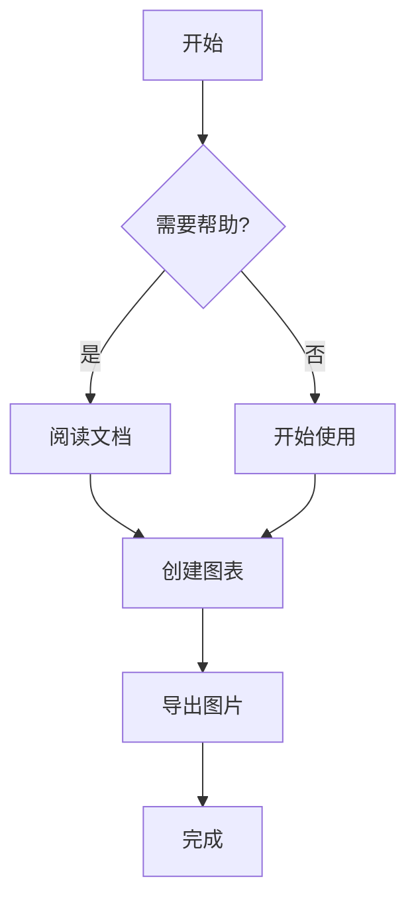
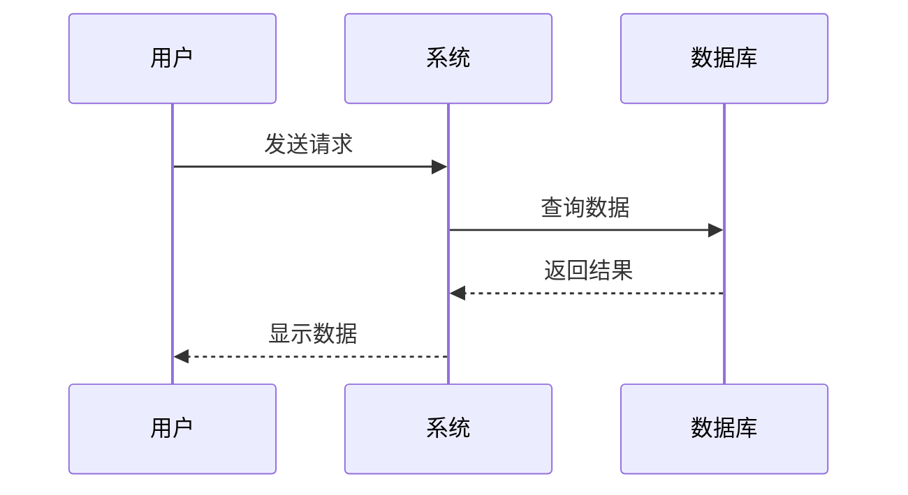
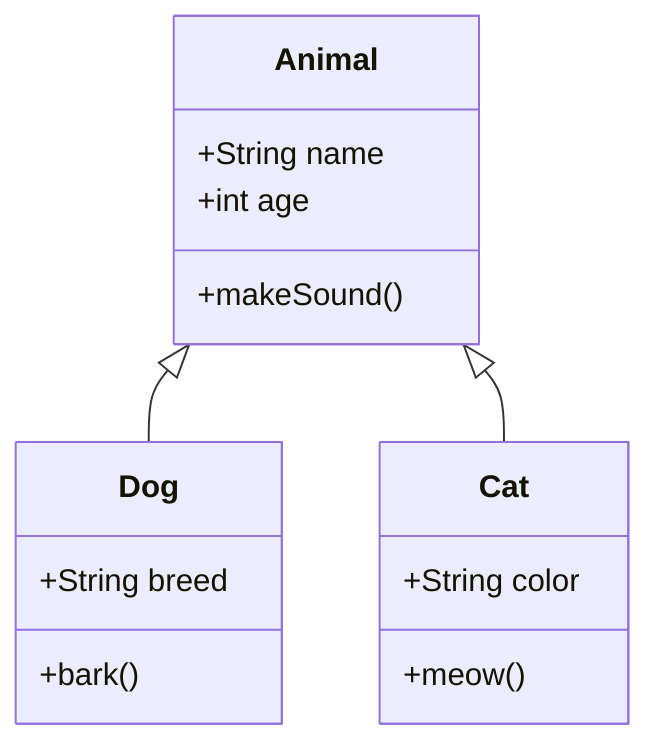
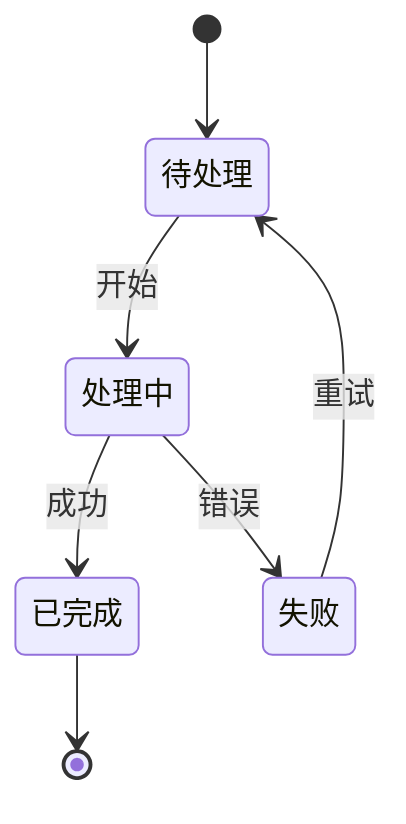

# Cherry Markdown Preview 示例

这是一个示例 Markdown 文件，展示了插件的各种功能。

## 数学公式

### 行内公式

爱因斯坦的质能方程：$E = mc^2$

勾股定理：$a^2 + b^2 = c^2$

### 块级公式

```math
\int_{-\infty}^{\infty} e^{-x^2} dx = \sqrt{\pi}
```

```math
\sum_{n=1}^{\infty} \frac{1}{n^2} = \frac{\pi^2}{6}
```

## Mermaid 图表

### 流程图



### 序列图



### 类图



### 状态图



## 其他 Markdown 功能

### 代码块

```javascript
function hello() {
  console.log('Hello, World!');
}
```

### 表格

| 功能 | 支持 | 说明 |
|------|------|------|
| 数学公式 | ✅ | 使用 KaTeX |
| Mermaid | ✅ | 点击可放大 |
| 代码高亮 | ✅ | 语法高亮 |
| 表格 | ✅ | 完整支持 |

### 引用

> 这是一个引用块
> 
> 可以包含多行内容

### 列表

- 无序列表项 1
- 无序列表项 2
  - 嵌套项 1
  - 嵌套项 2

1. 有序列表项 1
2. 有序列表项 2
3. 有序列表项 3

### 任务列表

- [x] 已完成的任务
- [ ] 未完成的任务
- [ ] 另一个任务

## 提示

- 点击任意 Mermaid 图表可以放大查看
- 在放大窗口中可以使用鼠标滚轮缩放（Ctrl/Cmd + 滚轮）
- 支持拖拽移动图表


