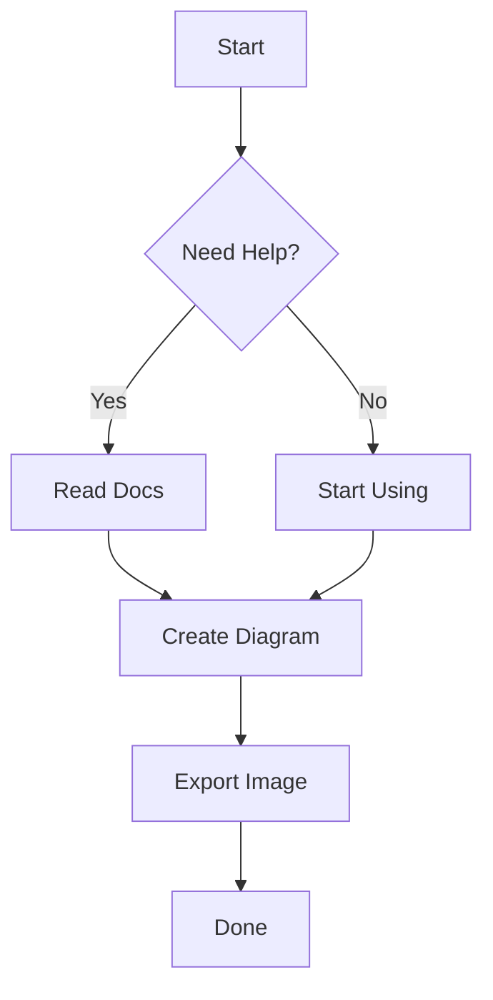

# MC Markdown Preview

[中文版](./README.zh-CN.md) | English

An elegant VSCode/Cursor Markdown preview extension with full support for mathematical formulas (KaTeX) and interactive Mermaid diagrams.


## ✨ Features

- 🎨 **Elegant UI**: Beautifully crafted styles inspired by Cherry Markdown, perfectly adapting to VSCode's **Light**, **Dark**, and **High Contrast** themes.
- 📐 **Math Formulas**: Seamless rendering of inline ($...$) and block mathematical equations using **KaTeX**.
- 🌊 **Interactive Mermaid**: 
    - Full support for flowcharts, sequence diagrams, gantt charts, and more.
    - **In-place Zoom & Pan**: No popups needed! Use `Ctrl/Cmd + Scroll` to zoom or drag to pan directly within the preview.
    - **Toolbar**: Built-in zoom in/out and reset buttons for every diagram.
- 💻 **Enhanced Code Blocks**:
    - **Syntax Highlighting**: Powered by `highlight.js` with auto-language detection.
    - **Language Labels**: Clear indication of the programming language.
    - **One-click Copy**: Quick copy button for every code snippet.
- 🌍 **Internationalization (i18n)**: Supports both English and Chinese UI based on VSCode settings.

## 🚀 Installation

### Manual Installation (.vsix)

1. Download the latest `mc-markdown-preview-x.x.x.vsix` from the [Releases](https://github.com/flowinginthewind700/MCMarkdown4Vs/releases) page.
2. In VSCode/Cursor, press `Cmd+Shift+P` (Mac) or `Ctrl+Shift+P` (Windows/Linux).
3. Type `Extensions: Install from VSIX...` and select the downloaded file.
4. **Important**: After installation, run `Developer: Reload Window` to activate the extension.

### Remote SSH Environment

If you are working on a remote server:
1. Connect to your Remote SSH session.
2. Open the Extensions view (`Cmd+Shift+X`).
3. Click the "Install from VSIX..." option in the `...` menu.
4. Select the `.vsix` file from your **local machine**. VSCode will automatically upload and install it on the remote host.
5. Alternatively, if the extension is already installed locally, you may see an "Install in SSH: [Host]" button in the extensions list.

## 📖 Usage

- **Open Preview**: Right-click any `.md` file in the editor or explorer and select **"Open MC Markdown Preview"**.
- **Commands**: Press `Cmd+Shift+P` and type `MC Markdown` to find the preview command.
- **Mermaid Controls**:
    - **Zoom**: `Ctrl + Scroll` or use the `+`/`-` buttons in the top-right of the diagram.
    - **Pan**: Click and drag the diagram area.
    - **Reset**: Click the `⟲` button to return to the original size and position.

## 🛠 Development

```bash
# 1. Install dependencies
npm install

# 2. Compile TypeScript
npm run compile

# 3. Package extension
# Requires @vscode/vsce installed globally: npm install -g @vscode/vsce
vsce package
```

## 📜 License

This project is licensed under the [MIT License](./LICENSE).


