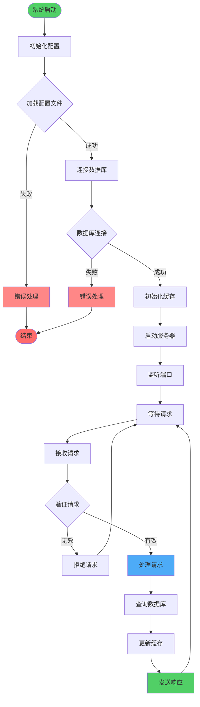
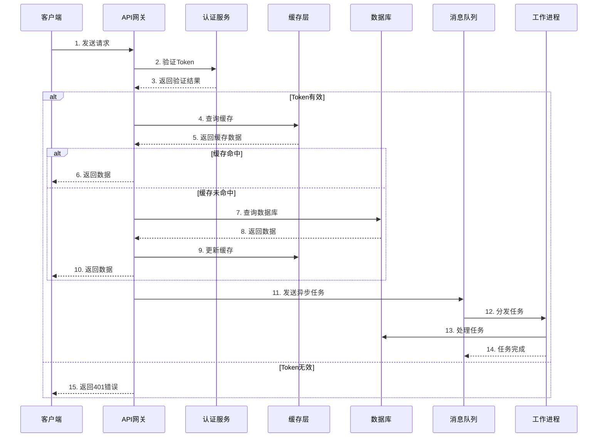
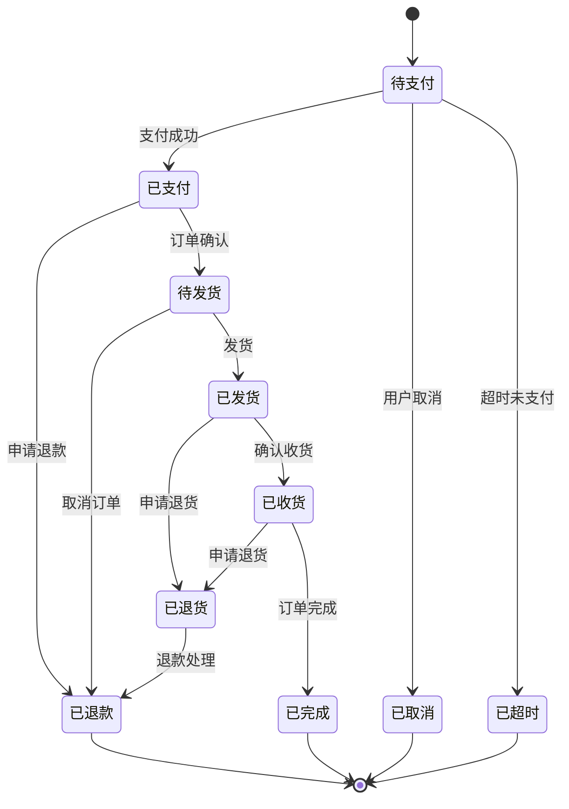
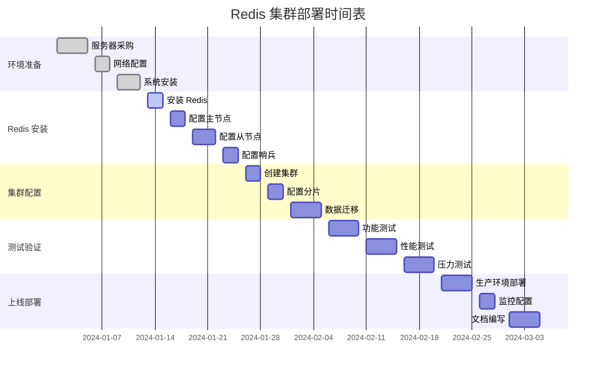
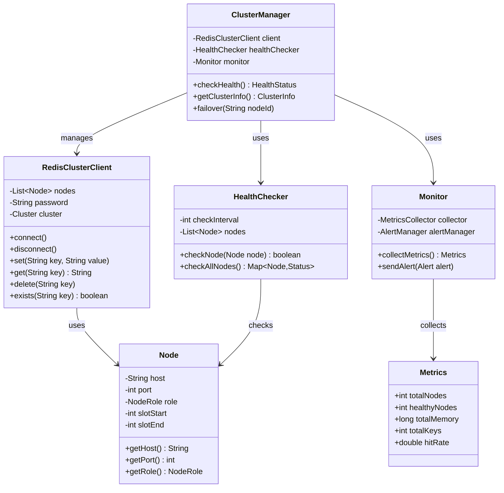
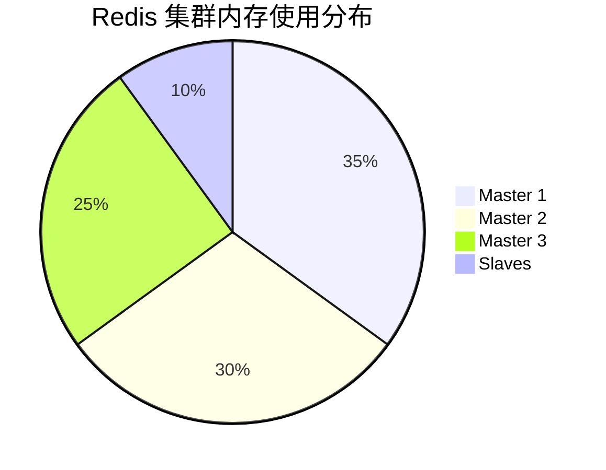

# 复杂 Markdown 测试文档

这是一个用于测试 MC Markdown Preview 插件的复杂文档，包含各种代码块、Mermaid 图表和数学公式。

## Redis 集群架构图

以下是一个 Redis 集群架构的 Mermaid 图表，展示了主从复制、哨兵模式和分片集群的完整架构：

```mermaid
graph TB
    subgraph ClientLayer[Client Layer]
        C1[Client 1]
        C2[Client 2]
        C3[Client 3]
        C4[Client 4]
    end

    subgraph SentinelCluster[Redis Sentinel Cluster]
        S1[Sentinel 1<br/>192.168.1.10:26379]
        S2[Sentinel 2<br/>192.168.1.11:26379]
        S3[Sentinel 3<br/>192.168.1.12:26379]
    end

    subgraph Group1[Redis Master-Slave Group 1]
        M1[Master 1<br/>192.168.1.20:6379<br/>Slot: 0-5460]
        SL1[Slave 1-1<br/>192.168.1.21:6379]
        SL2[Slave 1-2<br/>192.168.1.22:6379]
        M1 -->|Replication| SL1
        M1 -->|Replication| SL2
    end

    subgraph Group2[Redis Master-Slave Group 2]
        M2[Master 2<br/>192.168.1.30:6379<br/>Slot: 5461-10922]
        SL3[Slave 2-1<br/>192.168.1.31:6379]
        SL4[Slave 2-2<br/>192.168.1.32:6379]
        M2 -->|Replication| SL3
        M2 -->|Replication| SL4
    end

    subgraph Group3[Redis Master-Slave Group 3]
        M3[Master 3<br/>192.168.1.40:6379<br/>Slot: 10923-16383]
        SL5[Slave 3-1<br/>192.168.1.41:6379]
        SL6[Slave 3-2<br/>192.168.1.42:6379]
        M3 -->|Replication| SL5
        M3 -->|Replication| SL6
    end

    subgraph PersistenceLayer[Data Persistence Layer]
        RDB1[RDB Snapshot Master 1]
        RDB2[RDB Snapshot Master 2]
        RDB3[RDB Snapshot Master 3]
        AOF1[AOF Log Master 1]
        AOF2[AOF Log Master 2]
        AOF3[AOF Log Master 3]
    end

    C1 --> M1
    C1 --> M2
    C2 --> M2
    C2 --> M3
    C3 --> M1
    C3 --> M3
    C4 --> M1
    C4 --> M2
    C4 --> M3

    S1 -.->|Monitor| M1
    S1 -.->|Monitor| M2
    S1 -.->|Monitor| M3
    S2 -.->|Monitor| M1
    S2 -.->|Monitor| M2
    S2 -.->|Monitor| M3
    S3 -.->|Monitor| M1
    S3 -.->|Monitor| M2
    S3 -.->|Monitor| M3

    M1 --> RDB1
    M1 --> AOF1
    M2 --> RDB2
    M2 --> AOF2
    M3 --> RDB3
    M3 --> AOF3

    style M1 fill:#ff6b6b,stroke:#c92a2a,stroke-width:3px
    style M2 fill:#ff6b6b,stroke:#c92a2a,stroke-width:3px
    style M3 fill:#ff6b6b,stroke:#c92a2a,stroke-width:3px
    style SL1 fill:#4dabf7,stroke:#1971c2,stroke-width:2px
    style SL2 fill:#4dabf7,stroke:#1971c2,stroke-width:2px
    style SL3 fill:#4dabf7,stroke:#1971c2,stroke-width:2px
    style SL4 fill:#4dabf7,stroke:#1971c2,stroke-width:2px
    style SL5 fill:#4dabf7,stroke:#1971c2,stroke-width:2px
    style SL6 fill:#4dabf7,stroke:#1971c2,stroke-width:2px
    style S1 fill:#ffd43b,stroke:#fab005,stroke-width:2px
    style S2 fill:#ffd43b,stroke:#fab005,stroke-width:2px
    style S3 fill:#ffd43b,stroke:#fab005,stroke-width:2px
```



## 系统架构流程图



## 时序图示例



## 状态图示例



## Python 代码示例

以下是一个使用 Redis 集群的 Python 客户端示例：

```python
import redis
from redis.cluster import RedisCluster
from typing import Optional, List
import json
from datetime import timedelta

class RedisClusterClient:
    """Redis 集群客户端封装类"""
    
    def __init__(self, startup_nodes: List[dict], password: Optional[str] = None):
        """
        初始化 Redis 集群客户端
        
        Args:
            startup_nodes: 启动节点列表，格式: [{"host": "127.0.0.1", "port": 7000}, ...]
            password: Redis 密码（可选）
        """
        self.client = RedisCluster(
            startup_nodes=startup_nodes,
            password=password,
            decode_responses=True,
            skip_full_coverage_check=True
        )
    
    def set(self, key: str, value: str, ex: Optional[int] = None) -> bool:
        """设置键值对，支持过期时间"""
        return self.client.set(key, value, ex=ex)
    
    def get(self, key: str) -> Optional[str]:
        """获取键值"""
        return self.client.get(key)
    
    def set_json(self, key: str, data: dict, ex: Optional[int] = None) -> bool:
        """设置 JSON 数据"""
        return self.client.set(key, json.dumps(data), ex=ex)
    
    def get_json(self, key: str) -> Optional[dict]:
        """获取 JSON 数据"""
        value = self.client.get(key)
        return json.loads(value) if value else None
    
    def delete(self, *keys: str) -> int:
        """删除一个或多个键"""
        return self.client.delete(*keys)
    
    def exists(self, key: str) -> bool:
        """检查键是否存在"""
        return bool(self.client.exists(key))
    
    def expire(self, key: str, seconds: int) -> bool:
        """设置键的过期时间"""
        return self.client.expire(key, seconds)
    
    def close(self):
        """关闭连接"""
        self.client.close()

# 使用示例
if __name__ == "__main__":
    # 初始化集群客户端
    nodes = [
        {"host": "192.168.1.20", "port": 6379},
        {"host": "192.168.1.30", "port": 6379},
        {"host": "192.168.1.40", "port": 6379}
    ]
    
    redis_client = RedisClusterClient(nodes, password="your_password")
    
    try:
        # 设置和获取字符串
        redis_client.set("user:1001:name", "Alice", ex=3600)
        name = redis_client.get("user:1001:name")
        print(f"User name: {name}")
        
        # 设置和获取 JSON
        user_data = {
            "id": 1001,
            "name": "Alice",
            "email": "alice@example.com",
            "roles": ["admin", "user"]
        }
        redis_client.set_json("user:1001", user_data, ex=7200)
        data = redis_client.get_json("user:1001")
        print(f"User data: {data}")
        
    finally:
        redis_client.close()
```

## JavaScript/TypeScript 代码示例

```typescript
import Redis from 'ioredis';
import { Cluster } from 'ioredis';

interface RedisConfig {
  nodes: Array<{ host: string; port: number }>;
  password?: string;
  options?: {
    maxRetriesPerRequest?: number;
    enableReadyCheck?: boolean;
    redisOptions?: any;
  };
}

class RedisClusterManager {
  private cluster: Cluster;
  
  constructor(config: RedisConfig) {
    this.cluster = new Cluster(config.nodes, {
      password: config.password,
      maxRetriesPerRequest: config.options?.maxRetriesPerRequest ?? 3,
      enableReadyCheck: config.options?.enableReadyCheck ?? true,
      redisOptions: {
        ...config.options?.redisOptions,
        lazyConnect: true,
      },
    });
    
    this.setupEventHandlers();
  }
  
  private setupEventHandlers(): void {
    this.cluster.on('connect', () => {
      console.log('Redis cluster connected');
    });
    
    this.cluster.on('ready', () => {
      console.log('Redis cluster ready');
    });
    
    this.cluster.on('error', (err) => {
      console.error('Redis cluster error:', err);
    });
    
    this.cluster.on('node error', (err, node) => {
      console.error(`Redis node error [${node.options.host}:${node.options.port}]:`, err);
    });
  }
  
  async connect(): Promise<void> {
    await this.cluster.connect();
  }
  
  async set(key: string, value: string, ttl?: number): Promise<'OK'> {
    if (ttl) {
      return this.cluster.setex(key, ttl, value);
    }
    return this.cluster.set(key, value);
  }
  
  async get(key: string): Promise<string | null> {
    return this.cluster.get(key);
  }
  
  async setJSON<T>(key: string, data: T, ttl?: number): Promise<'OK'> {
    const jsonString = JSON.stringify(data);
    return this.set(key, jsonString, ttl);
  }
  
  async getJSON<T>(key: string): Promise<T | null> {
    const value = await this.get(key);
    return value ? JSON.parse(value) : null;
  }
  
  async delete(key: string): Promise<number> {
    return this.cluster.del(key);
  }
  
  async exists(key: string): Promise<boolean> {
    const result = await this.cluster.exists(key);
    return result === 1;
  }
  
  async expire(key: string, seconds: number): Promise<boolean> {
    const result = await this.cluster.expire(key, seconds);
    return result === 1;
  }
  
  async disconnect(): Promise<void> {
    await this.cluster.quit();
  }
}

// 使用示例
async function main() {
  const manager = new RedisClusterManager({
    nodes: [
      { host: '192.168.1.20', port: 6379 },
      { host: '192.168.1.30', port: 6379 },
      { host: '192.168.1.40', port: 6379 },
    ],
    password: 'your_password',
  });
  
  try {
    await manager.connect();
    
    // 设置和获取数据
    await manager.set('user:1001:name', 'Alice', 3600);
    const name = await manager.get('user:1001:name');
    console.log('User name:', name);
    
    // 设置和获取 JSON
    const userData = {
      id: 1001,
      name: 'Alice',
      email: 'alice@example.com',
      roles: ['admin', 'user'],
    };
    await manager.setJSON('user:1001', userData, 7200);
    const data = await manager.getJSON<typeof userData>('user:1001');
    console.log('User data:', data);
    
  } finally {
    await manager.disconnect();
  }
}

main().catch(console.error);
```

## Bash 脚本示例

```bash
#!/bin/bash

# Redis 集群健康检查脚本
# 用于监控 Redis 集群的状态

REDIS_NODES=(
    "192.168.1.20:6379"
    "192.168.1.30:6379"
    "192.168.1.40:6379"
    "192.168.1.21:6379"
    "192.168.1.31:6379"
    "192.168.1.41:6379"
)

REDIS_PASSWORD="your_password"
LOG_FILE="/var/log/redis-cluster-health.log"
ALERT_EMAIL="admin@example.com"

# 颜色定义
RED='\033[0;31m'
GREEN='\033[0;32m'
YELLOW='\033[1;33m'
NC='\033[0m' # No Color

log_message() {
    echo "[$(date '+%Y-%m-%d %H:%M:%S')] $1" | tee -a "$LOG_FILE"
}

check_redis_node() {
    local node=$1
    local host=$(echo $node | cut -d: -f1)
    local port=$(echo $node | cut -d: -f2)
    
    # 使用 redis-cli 检查节点状态
    if [ -n "$REDIS_PASSWORD" ]; then
        response=$(redis-cli -h "$host" -p "$port" -a "$REDIS_PASSWORD" ping 2>/dev/null)
    else
        response=$(redis-cli -h "$host" -p "$port" ping 2>/dev/null)
    fi
    
    if [ "$response" = "PONG" ]; then
        echo -e "${GREEN}✓${NC} Node $node is healthy"
        return 0
    else
        echo -e "${RED}✗${NC} Node $node is down"
        return 1
    fi
}

check_cluster_info() {
    local node=$1
    local host=$(echo $node | cut -d: -f1)
    local port=$(echo $node | cut -d: -f2)
    
    if [ -n "$REDIS_PASSWORD" ]; then
        redis-cli -h "$host" -p "$port" -a "$REDIS_PASSWORD" cluster info 2>/dev/null
    else
        redis-cli -h "$host" -p "$port" cluster info 2>/dev/null
    fi
}

main() {
    log_message "Starting Redis cluster health check..."
    
    failed_nodes=()
    healthy_nodes=0
    
    for node in "${REDIS_NODES[@]}"; do
        if check_redis_node "$node"; then
            ((healthy_nodes++))
        else
            failed_nodes+=("$node")
        fi
    done
    
    total_nodes=${#REDIS_NODES[@]}
    log_message "Health check completed: $healthy_nodes/$total_nodes nodes are healthy"
    
    if [ ${#failed_nodes[@]} -gt 0 ]; then
        log_message "WARNING: ${#failed_nodes[@]} node(s) are down: ${failed_nodes[*]}"
        
        # 发送告警邮件
        echo "Redis cluster health check failed. Failed nodes: ${failed_nodes[*]}" | \
            mail -s "Redis Cluster Alert" "$ALERT_EMAIL"
        
        exit 1
    else
        log_message "All nodes are healthy"
        
        # 显示集群信息
        echo ""
        echo "Cluster Information:"
        check_cluster_info "${REDIS_NODES[0]}"
        
        exit 0
    fi
}

main "$@"
```

## SQL 查询示例

```sql
-- Redis 集群监控数据表结构
CREATE TABLE redis_cluster_nodes (
    id BIGINT PRIMARY KEY AUTO_INCREMENT,
    node_host VARCHAR(255) NOT NULL,
    node_port INT NOT NULL,
    node_role ENUM('master', 'slave', 'sentinel') NOT NULL,
    slot_range_start INT,
    slot_range_end INT,
    status ENUM('online', 'offline', 'failover') DEFAULT 'online',
    last_check_time TIMESTAMP DEFAULT CURRENT_TIMESTAMP,
    response_time_ms INT,
    memory_used_mb BIGINT,
    keys_count BIGINT,
    created_at TIMESTAMP DEFAULT CURRENT_TIMESTAMP,
    updated_at TIMESTAMP DEFAULT CURRENT_TIMESTAMP ON UPDATE CURRENT_TIMESTAMP,
    INDEX idx_node (node_host, node_port),
    INDEX idx_status (status),
    INDEX idx_last_check (last_check_time)
);

-- 插入节点信息
INSERT INTO redis_cluster_nodes 
    (node_host, node_port, node_role, slot_range_start, slot_range_end, status)
VALUES
    ('192.168.1.20', 6379, 'master', 0, 5460, 'online'),
    ('192.168.1.21', 6379, 'slave', NULL, NULL, 'online'),
    ('192.168.1.22', 6379, 'slave', NULL, NULL, 'online'),
    ('192.168.1.30', 6379, 'master', 5461, 10922, 'online'),
    ('192.168.1.31', 6379, 'slave', NULL, NULL, 'online'),
    ('192.168.1.32', 6379, 'slave', NULL, NULL, 'online'),
    ('192.168.1.40', 6379, 'master', 10923, 16383, 'online'),
    ('192.168.1.41', 6379, 'slave', NULL, NULL, 'online'),
    ('192.168.1.42', 6379, 'slave', NULL, NULL, 'online');

-- 查询所有主节点
SELECT 
    node_host,
    node_port,
    CONCAT(slot_range_start, '-', slot_range_end) AS slot_range,
    status,
    memory_used_mb,
    keys_count
FROM redis_cluster_nodes
WHERE node_role = 'master'
ORDER BY slot_range_start;

-- 查询节点健康状态统计
SELECT 
    status,
    COUNT(*) AS node_count,
    AVG(response_time_ms) AS avg_response_time,
    SUM(memory_used_mb) AS total_memory_mb,
    SUM(keys_count) AS total_keys
FROM redis_cluster_nodes
GROUP BY status;

-- 查询最近检查的节点
SELECT 
    node_host,
    node_port,
    node_role,
    status,
    response_time_ms,
    TIMESTAMPDIFF(SECOND, last_check_time, NOW()) AS seconds_since_check
FROM redis_cluster_nodes
ORDER BY last_check_time DESC
LIMIT 10;
```

## 数学公式示例

### 缓存命中率计算

缓存命中率是衡量缓存系统性能的重要指标：

$$
\text{Hit Rate} = \frac{\text{Cache Hits}}{\text{Cache Hits} + \text{Cache Misses}} \times 100\%
$$

### Redis 内存使用估算

对于 Redis 集群，内存使用可以通过以下公式估算：

$$
M = \sum_{i=1}^{n} (K_i \times S_i + O_i)
$$

其中：
- $M$ 是总内存使用量
- $n$ 是节点数量
- $K_i$ 是第 $i$ 个节点的键数量
- $S_i$ 是平均键大小
- $O_i$ 是第 $i$ 个节点的开销（元数据、索引等）

### 分片算法

Redis 集群使用 CRC16 算法进行键分片：

$$
\text{Slot} = \text{CRC16}(\text{key}) \bmod 16384
$$

### 一致性哈希

对于分布式缓存，一致性哈希算法可以表示为：

$$
h(x) = \left\lfloor \frac{2^{32} \times \text{hash}(x)}{2^{32}} \right\rfloor
$$

## 甘特图示例



## 类图示例



## 饼图示例



## 总结

这个测试文档包含了：

1. ✅ **复杂的 Mermaid 图表**：
   - Redis 集群架构图（包含多个子图、节点、连接和样式）
   - 系统流程图
   - 时序图
   - 状态图
   - 甘特图
   - 类图
   - 饼图

2. ✅ **多种代码块**：
   - Python 代码（包含类、方法、类型提示）
   - TypeScript 代码（包含接口、类、泛型）
   - Bash 脚本（包含函数、条件判断、循环）
   - SQL 查询（包含 DDL、DML、复杂查询）

3. ✅ **数学公式**：
   - 缓存命中率公式
   - 内存使用估算公式
   - 分片算法公式
   - 一致性哈希公式

4. ✅ **其他 Markdown 元素**：
   - 多级标题
   - 列表
   - 表格
   - 代码块语法高亮
   - 文本格式化

这个文档可以用来全面测试 MC Markdown Preview 插件的所有功能特性！

